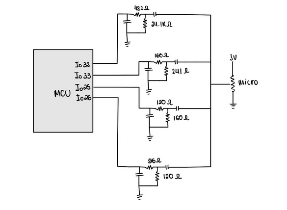
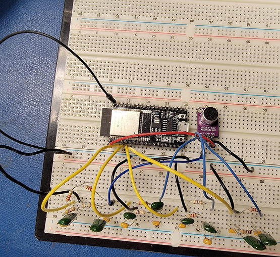

# Audio Spectrum Visualizer

## Custom 8×8 Matrix (LED + ESP32)

### Overview
This is an 8×8 LED matrix audio spectrum visualizer built with an ESP32. Audio input from a microphone is passed through a passive analog RC filter bank (4 bands), then smoothed digitally using a moving average filter. The filtered signals are visualized in real time on a hand-wired LED matrix controlled using shift registers and MOSFETs.

### Features
- Passive RC filter bank for 4 frequency bands  
- Digital low-pass filter (moving average)  
- Real-time visualization on 8×8 LED matrix  
- Matrix driven with CD4015BE shift registers + pMOS/nMOS  
- Fully custom-built: all components soldered by hand

### Hardware
- ESP32 dev board  
- Analog microphone  
- RC components (resistors + capacitors)  
- CD4015BE shift registers (×2)  
- 8 nMOS + 8 pMOS transistors  
- 64 discrete LEDs  
- Current-limiting + gate resistors  
- Custom protoboard  
- Jumper wires / basic tools

### Concepts Used
- Analog filtering (RC bandpass)  
- Digital smoothing (moving average)  
- LED matrix scanning + timing  
- Embedded C++ on ESP32  
- Soldering and prototyping  
- Bitstream control with shift registers  
- Real-time signal buffering

### Demo  
[Video demo (Google Drive)](https://drive.google.com/file/d/1ljkxKp7Rt3Fkti2Buf-A8JXW3eGOZwb8/view)

### Photos

**RC Filter Bank Schematic**  

**RC Filter Bank Circuit**  

**LED Matrix 8×8 Circuit**  

---

## 64×32 LED Matrix (Prebuilt)

### Overview
Same general setup as the 8×8 version, but with a prebuilt 64×32 RGB LED matrix instead of a hand-wired one. Still uses the same RC filter bank and digital smoothing, but the display is controlled via a driver library (instead of shift registers), and the result is a much higher-res, cleaner animation with a color gradient.

### Why it exists  
This version was built to test improvements like:
- Better refresh rate (no flicker, faster scan)
- Smoother animations with more bars + higher resolution
- Easier wiring (plug-and-play panel)
- Ability to use color gradient to show amplitude

### Notes
- Still uses the same analog RC filter bank as the 8×8  
- Also uses a digital low-pass (moving average) for smoothing  
- Display output handled by ESP32 matrix driver library  
- MEMS mic used here instead of analog breakout mic
