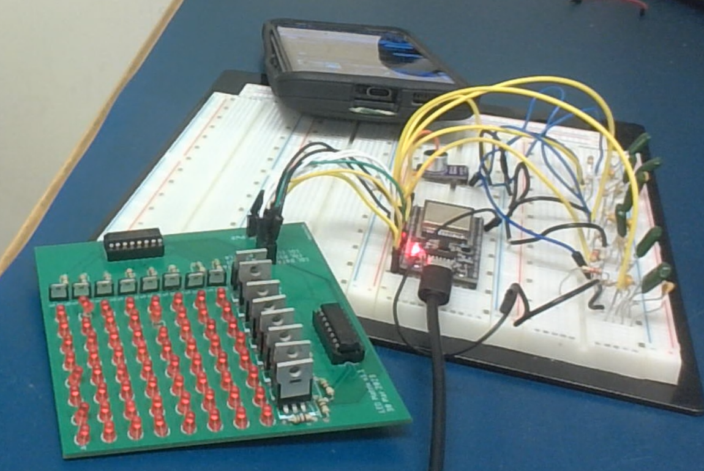

# Audio Spectrum Visualizer (ESP32 + LED Matrix)

## Overview
This project is an 8×8 LED matrix audio spectrum visualizer built using an ESP32. Microphone input is passed through a passive analog filter bank (RC filters) to isolate frequency bands. The resulting signals are smoothed using a digital low-pass filter (moving average) and visualized in real time on an LED matrix. The matrix is controlled via shift registers and MOSFETs.

## Features
- Passive RC filter bank to isolate 4 frequency bands
- Real-time audio visualization on an 8×8 LED matrix
- Digital signal smoothing with a moving average filter
- LED matrix controlled via CD4015BE shift registers and pMOS/nMOS transistors
- Custom-built proto board with all components soldered by hand

## Hardware Used
- ESP32 development board  
- Microphone sensor  
- Resistors and capacitors for RC filters  
- CD4015BE shift registers (x2)  
- 8 nMOS and 8 pMOS transistors  
- 64 LEDs  
- Resistors for current limiting and gate control  
- Custom proto board or PCB  
- Jumper wires, headers, basic tools

## Concepts Practiced
- Analog signal filtering using RC circuits  
- Digital low-pass filtering via moving average  
- Matrix scanning and LED control logic  
- Embedded C++ programming on ESP32  
- Soldering and prototyping  
- Shift register data handling  
- Buffering and real-time signal processing

## Demo
https://drive.google.com/file/d/1ljkxKp7Rt3Fkti2Buf-A8JXW3eGOZwb8/view

## Photos

