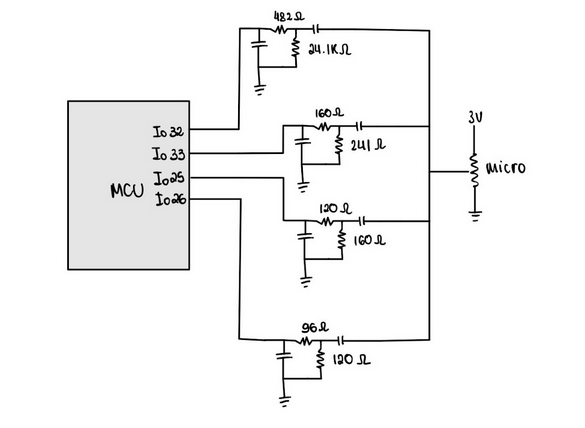
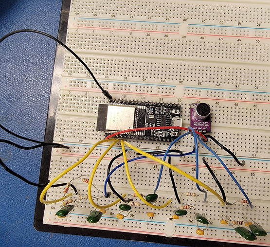
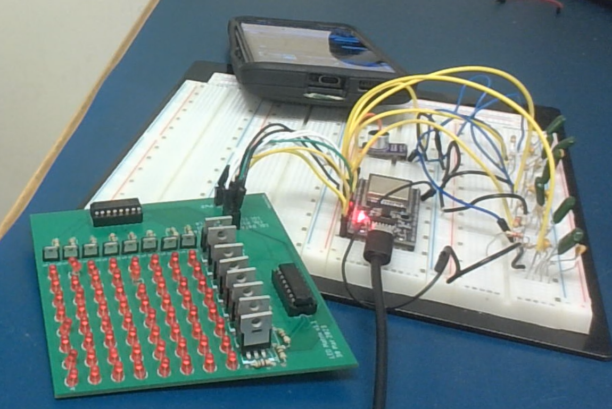

# Audio Spectrum Visualizer

## Custom 8×8 Matrix (LED + ESP32)

### Overview  
This is an 8×8 LED matrix audio spectrum visualizer built with an ESP32. Audio input from a microphone goes through a passive analog RC filter bank (4 bands), then through a digital moving average filter. The signal is displayed in real time on a hand-wired LED matrix controlled using shift registers and discrete transistors. The code for this is contained in the file "8x8LedMatrixCode.cpp".

### Features  
- Passive RC filter bank (4 frequency bands)  
- Digital low-pass filter (moving average)  
- 8×8 matrix visual display  
- CD4015BE shift registers + pMOS/nMOS transistors  
- All components manually soldered on a protoboard  

### Hardware  
- ESP32 dev board  
- Analog mic  
- RC components (R + C)  
- CD4015BE shift registers (×2)  
- 8 pMOS + 8 nMOS  
- 64 discrete LEDs  
- Resistors for current limiting + gate control  
- Custom protoboard, jumper wires, etc.

### Concepts  
- Analog bandpass filtering (RC)  
- Digital smoothing (moving average)  
- LED matrix scanning logic  
- Embedded C++ with real-time timing  
- Shift register bit control  
- Prototyping, soldering, and debugging

### Demo  
(https://drive.google.com/file/d/1ljkxKp7Rt3Fkti2Buf-A8JXW3eGOZwb8/view)

### Photos  
**RC Filter Bank Schematic**  

**RC Filter Bank Circuit**  

**8×8 LED Matrix Circuit**  

---

## Prebuilt 64×32 RGB Matrix Version

### Overview  
This version uses a commercial 64×32 RGB LED matrix, still running on ESP32. The signal chain is the same - RC filter bank + digital smoothing - but output is handled by a driver library that controls the built-in shift registers and row drivers in the matrix. Way faster refresh rate, much smoother bars, and uses color to show amplitude. The code for this is contained in the file "64x32MatrixCode.cpp".

### Why I Made It  
- Wanted a higher-resolution, cleaner visual  
- Refresh rate on 8×8 was too low  
- Didn’t want to manually wire 2048 LEDs  
- Still wanted full control over audio pipeline (RC + digital filtering)

### Notes  
- Matrix still uses shift registers internally, just abstracted by the driver code  
- Uses same RC filter bank from the 8×8 version  
- Output controlled through a matrix library (like PxMatrix or Adafruit Protomatter)  
- MEMS mic used here instead of analog mic for better quality  
- 64 columns -> finer frequency resolution  
- RGB w/ gradient -> more interesting display

### Demo
(https://www.youtube.com/watch?v=AJzHhXwQKkE)
